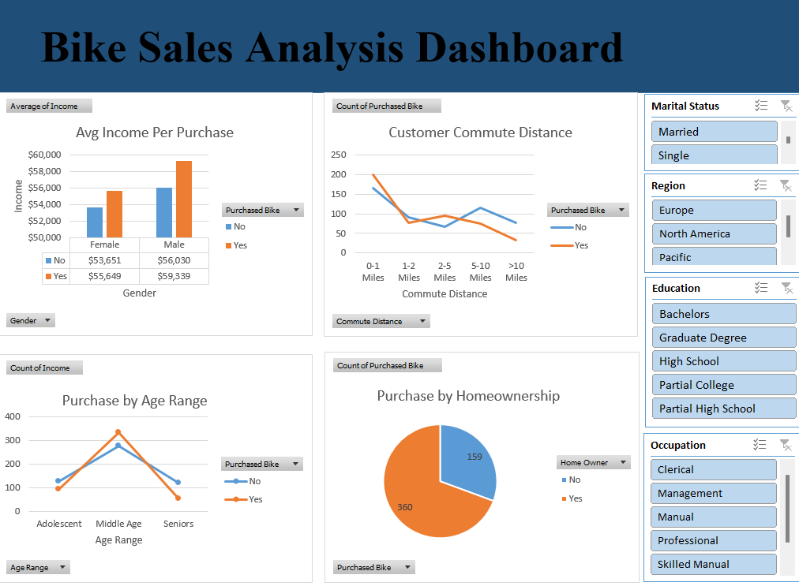

# Bike Sales Analysis
An Excel project analyzing a dataset containing details of 1000 users to identify trends in bike purchases.

## Table of Contents
- [Project Objective](#project-objective)
- [Expected Outcome](#expected-outcome)
- [Document Purpose](#document-purpose)
- [Use Case](#use-case)
- [Data Source](#data-source)
- [Data Cleaning and Processing](#data-cleaning-and-processing)
- [Data Analysis](#data-analysis)
- [Recommendations](#recommendations)
- [Conclusion](#conclusion)

---

## Project Objective
Using Excel, I performed data cleaning, transformation, and analysis to gain insights into customer behavior. Key analysis included the relationship between customer demographics (age, gender, income, etc.) and bike purchase behavior. 

## Project Aim
The project aimed to explore how factors such as commute distance, age, and income impact bike sales and help businesses better understand their target audience.

---

## Expected Outcome
The expected outcome of this analysis was to:
- Understand the factors influencing bike purchases among different customer groups.
- Identify trends based on demographics, commute distance, and income.
- Provide actionable insights to target specific customer groups for marketing purposes.
- Develop a dashboard that offers interactive insights into bike purchasing patterns based on customer characteristics.

---

## Document Purpose
The purpose of this document is to showcase the steps taken to clean, analyze, and visualize the data, as well as the key findings from the analysis. This serves as a detailed walkthrough for anyone interested in understanding how data analysis can be performed using Excel, along with the methods used to visualize and interpret customer behavior in relation to bike purchases.

---

## Use Case
This analysis is highly relevant to businesses in the retail or bicycle industry. The findings can help:
- Marketing teams develop campaigns targeting specific demographics (e.g., age groups or income levels).
- Businesses plan their inventory based on expected demand from certain customer segments.
- Improve customer experience by understanding their preferences, such as the most common commute distances or purchasing trends among different regions.

---

## Data Source
The dataset used in this project was sourced from kaggle, titled **"Bike Buyers 1000"**, consists of 1000 rows containing information on various customer demographics, including age, gender, income, and bike purchase behavior. The output variable is whether or not a customer purchased a bike.

---

## Data Cleaning and Processing
- **Missing Values**: No missing values were detected, as the dataset was cleaned for blanks or anomalies before analysis.
- **Duplicate Values**: No duplicates were identified.
- **Age Grouping**: I used an IF statement to categorize customers into three age groups (Adolescent, Middle Age, Seniors).  
  **Formula**:  
  `=IF(L2>55,"Seniors",IF(L2>=35,"Middle Age",IF(L2<35,"Adolescent","Invalid")))`
- **Data Transformation**: Columns were formatted for consistency, and new features (like age range) were created.

---

## Data Analysis
Four key analyses were performed using Pivot Tables and corresponding charts:

1. **Average Income per Purchase**:  
   - A clustered column chart showing the average income of buyers, segmented by gender and whether they purchased a bike.
   

2. **Commute Distance vs. Purchases**:  
   - A simple line chart showing how commute distance correlates with bike purchases.
   

3. **Purchase by Age Range**:  
   - A line chart with markers to show the trend of bike purchases across different age ranges.
   

4. **Purchases by Homeownership**:  
   - A pie chart showing the proportion of bike purchases by homeowners vs. non-homeowners.
 

These analyses were included in an interactive dashboard with slicers for **Education**, **Region**, **Occupation**, and **Marital Status**.

## Data Visualization

## Recommendations
Based on the analysis, the following recommendations can be made:
- **Target Middle-Aged Customers**: Middle-aged individuals (35-55) are the most likely to purchase bikes. Marketing campaigns can focus on this group, particularly in regions where bike sales are higher.
- **Incentives for Homeowners**: Homeowners are more likely to purchase bikes, so offering exclusive discounts to homeowners could drive additional sales.
- **Commute-Focused Marketing**: Customers who commute 0-1 miles are more likely to purchase bikes. Target this group with promotions related to commuting or biking for fitness.
- **Age-Based Promotions**: For younger customers, such as adolescents and young adults, promotions around fitness or cycling-related activities could increase engagement and bike sales.

---

## Conclusion
This analysis highlights several important trends related to bike purchasing behavior. The age group, income level, and commute distance are critical factors in determining whether a customer will buy a bike. By leveraging these insights, businesses can tailor their marketing strategies to specific customer segments and drive more targeted sales campaigns. The dashboard created in Excel allows for dynamic analysis of the data, offering a user-friendly way to explore different customer attributes and their impact on bike sales.

### MAIL
fezzythrillz@gmail.com
